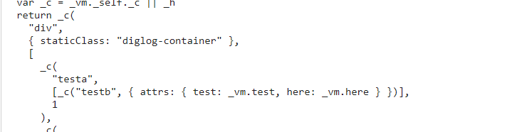

# client_vue_element

## Project setup

```
npm install
```

### Compiles and hot-reloads for development

```
npm run serve
```

### Compiles and minifies for production

```
npm run build
```

### Lints and fixes files

```
npm run lint
```

### Customize configuration

See [Configuration Reference](https://cli.vuejs.org/config/).

### 记录几个好看的色号

-   青青草原绿 #00d053
-   傻白甜的蓝 #409eff
-   迷人的红 #f56767

### mark 下新发现



### console.table(function)

-   可以打印出整个函数

*   组件中 dialog.fun 和 dialog.fun() 的坑一定要注意，在组件中这是两个不同的概念，mark 已经踩坑
